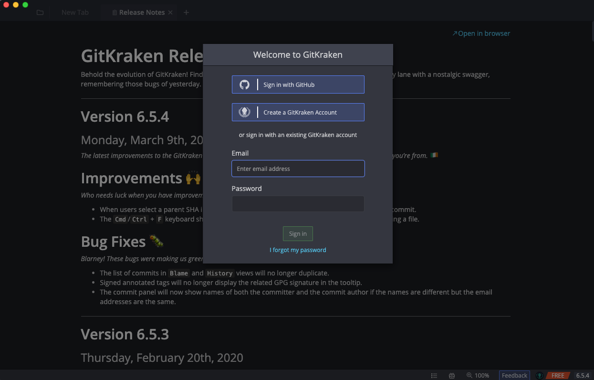
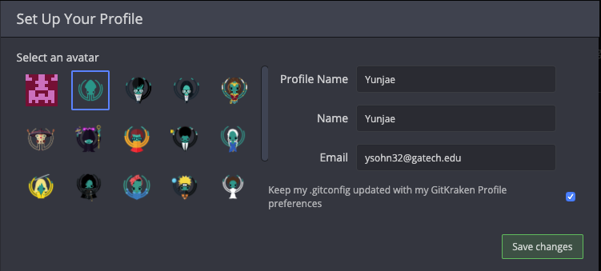
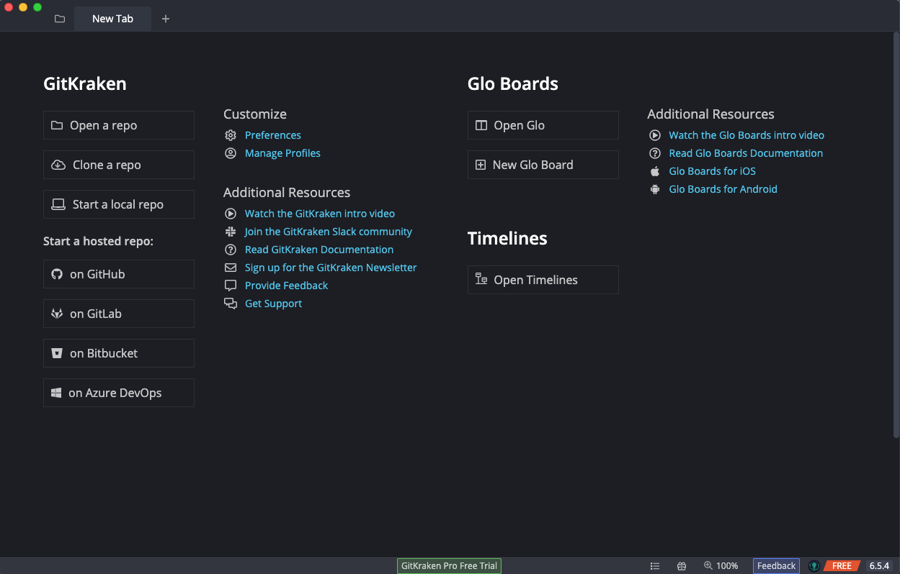

# Chapter 3: Introduction to Git

In this chapter, we will explore the basics of Git and start using it!

## Git Kraken

For this course, we will use software called Git Kraken that provides a nice user interface for all the features available in Git. Follow the instructions below to install and set up Git Kraken on your computer.

### Setup Instructions

* Create a Github account here: [https://github.com/join](https://github.com/join).
  * Enter your information, then click "Select plan".
  * Select Individual free.
  * Feel free to exit at this point.
* Download Git Kraken here: [https://www.gitkraken.com/download](https://www.gitkraken.com/download).
* Open the installer and follow instructions to install.
* Launch Git Kraken. You should see a screen like the following image

* Click "Sign in with Github".
* Click authorize and enter your password if requested.
* Click authorize again.
* Once you see the success screen as below, close the browser window and return to Git Kraken.

* Create your Git Kraken profile by filling in information and clicking "Save Changes", as is shown below.

* Close the popup and release notes tab.
* Once your Git Kraken looks like this, you're ready to go!

## Partners

You will need a partner for the exercises in this and all following chapters, as each partner will have a different role and a separate set of instructions. Note that Git is an amazing collaborative software, but it does not replace traditional communication. You should talk to your partner as you go through the course and discuss things you've learned. Both partners will have learned the same content by the end of the course, but discussing as you are learning is highly encouraged to further your grasp of the concepts here.

Designate one of you *Student A* and one *Student B*. Then click your respective links below to get to your specific exercise instructions!

### [Student A](chapter3_student_a.md)
### [Student B](chapter3_student_b.md)
