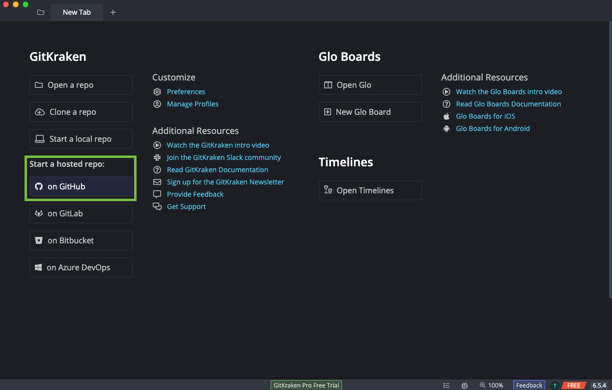
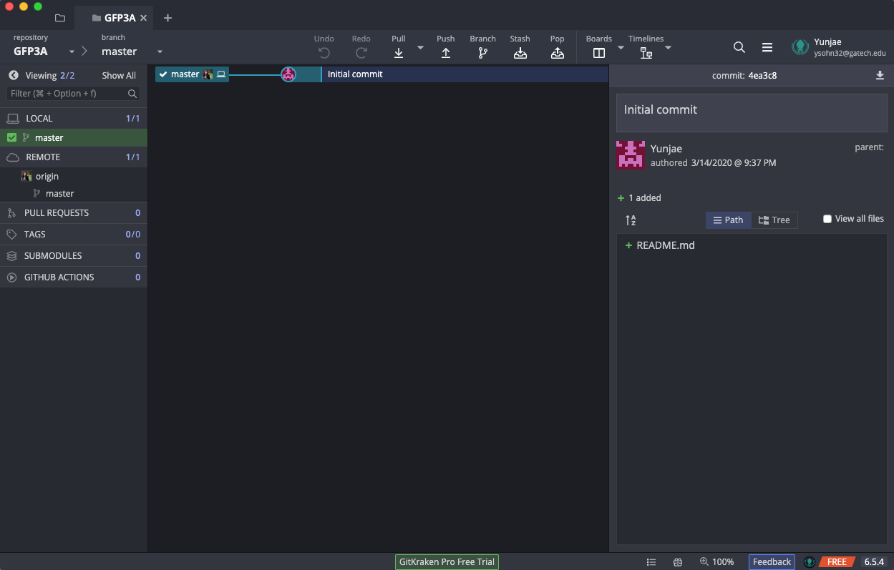

# Chapter 3: Introduction to Git - Exercises

## Student A

Welcome, Student A! Your partner is going through a similar guide right now. Let us first cover some basics on how to coordinate with your partner since you'll have different roles, but still be required to work together.

The most important feature to note is the sync-up checkpoint. Throughout the guide, you will see numbered checkpoints like the one below this paragraph. When you reach one of these, you should notify your partner that you have reached the checkpoint, including the number. If your partner had already reached the same checkpoint, you may both continue onwards; otherwise, you will need to wait until your partner reaches their checkpoint. Let's practice with the one below. Sync up with your partner to ensure you've both reached this point in the exercise.

> :warning: **Checkpoint 1** :warning:

Great! Now that we're all synced up, let's go over some Git terminology. 

* **Repo**: Short for "repository," which is another way to say project. Everything in one repo is tracked together and has a shared history. On your computer, a repo will be a folder.
* **Commit**: One instance of changes saved in the repo history. A commit can contain changes from multiple files and is always accompanied by a message describing the changes in the commit.
* **Staged**: Changes that you plan to commit, but have not yet committed. After making changes, you will stage the changes you want and then commit them all together.
* **WIP**: Acronym standing for "Work In Progress." Often used to signify work that is incomplete or not yet commited.
* **Clone**: Download a repository to your computer. You will clone a repository created by your partner in this exercise.
* **Merge**: Combine changes from two separate commits. This action creates a new commit with the results of the merge.

## Let's *Git* into it

In this exercise, you will be creating a repo, saving some work, and merging some work from your partner.

### Create a Repo

To begin, click "on GitHub" under "Start a hosted repo".

In the menu, select your own user and then copy the name and description fields as shown below. Then select somewhere reasonable to save your project on your computer and click "Create repository and clone".

You should now have a tab in Git Kraken that looks similar to the following screenshot. This is your new repo with the automatic initial commit. GitKraken also added an empty README file for you. This view shows all the entries in the history of the repo. There isn't much here yet.

Now you need to share the repo with your partner so they can also have access to it. Get the Github url by clicking on "origin" as shown in the picture below, and then selecting "View origin on Github.com".

You'll now need to copy and share the URL to this page with your partner.

> :warning: **Checkpoint 2** :warning:

### Add and Commit Changes

Now it's time to contribute some content. Right click the README.md in the pane on the right and select "edit file"

In the editing window, add a line to the bottom of the file that says "[your name] was here!" and save your changes with your OS shortcut for save (command + s or ctrl + s). Note that you can make any changes to the files in this repo, including using applications outside of GitKraken, and GitKraken will detect and show them. Once you save your change, your UI should change and you'll see a screen like the following:

Now we're going to commit this change. We will save this state of the project to the history. Click "Stage all changes" at the top right of the pane on the right. Then type in your commit message, a summary of what's changed, in the box at the bottom right as shown in the following screenshot.

Finally, click "Commit changes to 1 file" at the bottom of the window. You should now have a new entry in your commit log history view!

### Sync up with your Partner

You're likely ahead of your partner at this point since they had to clone the repo you created. That means you get to push your changes first.

In your commit log view, click "Push" in the top bar. This will take a few seconds and then you'll see a popup showing that your changes were successfully pushed.

> :warning: **Checkpoint 3** :warning:

Now we need to wait for your partner to push their changes. This shouldn't take more than 5 minutes.

> :warning: **Checkpoint 4** :warning:

Great! Now you should have a commit log that looks similar to this.

You'll need to click "Pull" at the top to pull the new changes from your partner into your local copy of the repo.

Let's look at README.md now. Right click README.md and select "Open in default program".

You should see that the README.md file now has the contributions from both you and your partner!

## Conclusion

In this chapter, you used Git for the first time, using the Git Kraken software. You created a repo on Github, made and committed a change, pushed your change, and finally pulled another change from your partner that Git automatically merged with your change. In the next chater your partner will create a repo so you can get practice cloning a repo and merging changes.

### [Chapter 4: Tracking work with Git](../Chapter4)
