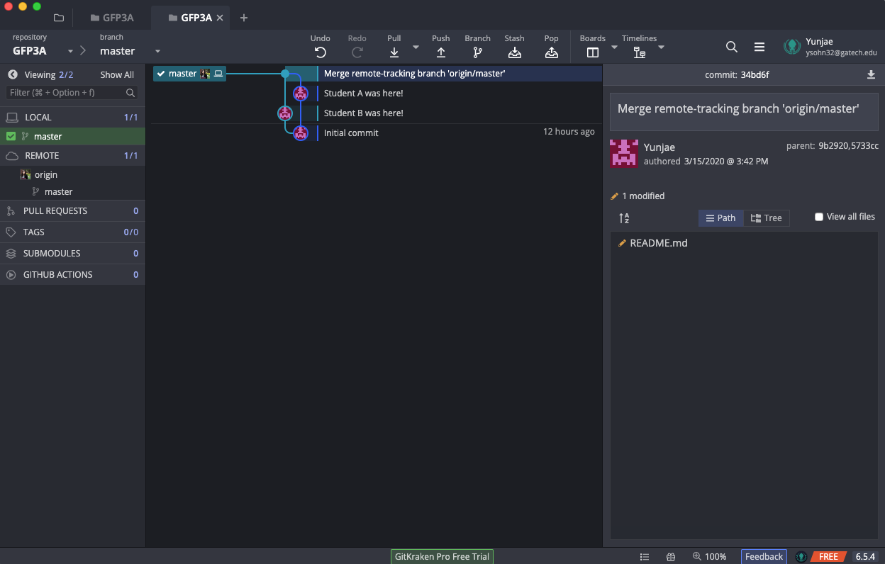

# Chapter 3: Introduction to Git - Exercises

## Student B

Welcome, Student B! Your partner is going through a similar guide right now. Let us first cover some basics on how to coordinate with your partner since you'll have different roles, but still be required to work together.

The most important feature to note is the sync-up checkpoint. Throughout the guide, you will see numbered checkpoints like the one below this paragraph. When you reach one of these, you should notify your partner that you have reached the checkpoint, including the number. If your partner had already reached the same checkpoint, you may both continue onwards; otherwise, you will need to wait until your partner reaches their checkpoint. Let's practice with the one below. Sync up with your partner to ensure you've both reached this point in the exercise.

#### :warning: **Checkpoint 1** :warning:

Great! Now that we're all synced up, let's go over some Git terminology. 

* **Repo**: Short for "repository," which is another way to say project. Everything in one repo is tracked together and has a shared history. On your computer, a repo will be a folder.
* **Commit**: One instance of changes saved in the repo history. A commit can contain changes from multiple files and is always accompanied by a message describing the changes in the commit.
* **Staged**: Changes that you plan to commit, but have not yet committed. After making changes, you will stage the changes you want and then commit them all together.
* **WIP**: Acronym standing for "Work In Progress." Often used to signify work that is incomplete or not yet commited.
* **Clone**: Download a repository to your computer. You will clone a repository created by your partner in this exercise.
* **Merge**: Combine changes from two separate commits. This action creates a new commit with the results of the merge.

## Let's *Git* into it

In this exercise, you will be cloning a repo, saving some work, and merging some work from your partner.

Your partner needs to create the repo before you can clone it.

#### :warning: **Checkpoint 2** :warning:

### Clone a Repo

You should have received a link to a Github project from your partner at Checkpoint 2. Go to this URL and click the "Clone or Download" button as shown in the screenshot below. Make sure you have the https link in the popup and copy that URL. We'll use that to clone the repo in Git Kraken.

To clone your partner's repo, click "Clone a Repo" in the left-side menu. In the menu that appears, select a reasonable spot on your computer to save this new project. Then paste the URL you copied from github into the second box. Your screen should look similar to the following (but with a different path and URL).

After cloning completes, click "Open now" in the popup at the top of the window. You should now have a tab in Git Kraken that looks similar to the following screenshot. This view shows all the entries in the history of the repo. There isn't much here yet.

### Add and Commit Changes

Now it's time to contribute some content. Right click the README.md in the pane on the right and select "edit file"

In the editing window, add a line to the bottom of the file that says "[your name] was here!" and save your changes with your OS shortcut for save (command + s or ctrl + s). Note that you can make any changes to the files in this repo, including using applications outside of GitKraken, and GitKraken will detect and show them. Once you save your change, your UI should change and you'll see a screen like the following:

Now we're going to commit this change. We will save this state of the project to the history. Click "Stage all changes" at the top right of the pane on the right. Then type in your commit message, a summary of what's changed, in the box at the bottom right as shown in the following screenshot.

Finally, click "Commit changes to 1 file" at the bottom of the window. You should now have a new entry in your commit log history view!

### Sync up with your Partner

Your partner probably got here before you since you had to clone the repo they had already created. That means they will push their changes first. Let's sync up to make sure they've done so.

#### :warning: **Checkpoint 3** :warning:

Now it's your turn to push your changes. Your commit log view should have changed a bit to look similar to the following screenshot showing your partner's commit.

You'll need to do a merge to push your changes now. Click "Push" in the top bar. You should get a warning notification like the following:

Click the green option that says "Pull (fast-forward if possible)". This will pull your partners changes and automatically merge your changes together. Once this completes, your changes have been pushed. Let's sync back up with your partner.

#### :warning: **Checkpoint 4** :warning:

Great! Now you should have a commit log that looks similar to this.

Let's look at README.md now. Right click README.md and select "Open in default program".

You should see that the README.md file now has the contributions from both you and your partner!

## Conclusion

In this chapter, you used Git for the first time, using the Git Kraken software. You clone a repo from Github, made and committed a change, saw Git automatically merge your change with your partner's, and finally pushed your change. In the next chapter, you will create the repo so you can get practice creating a repo and pulling changes.
