# Chapter 4: Tracking work with Git - Setup

## Student B

You will be creating the repo for this part of the course.

### Create a Repo

To begin, create a new tab in Git Kraken, then click "on GitHub" under "Start a hosted repo".

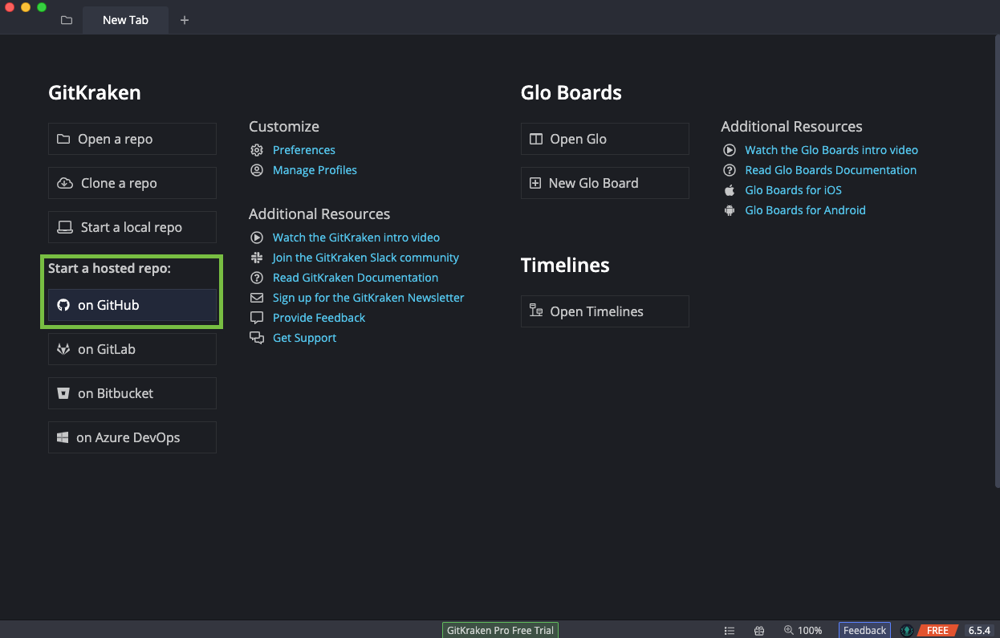

In the menu, select your own user and then copy the name and description fields as shown below. Add an underscore followed by your name to the repo name field to ensure that it is unique. Then select somewhere reasonable to save your project on your computer and click "Create repository and clone".

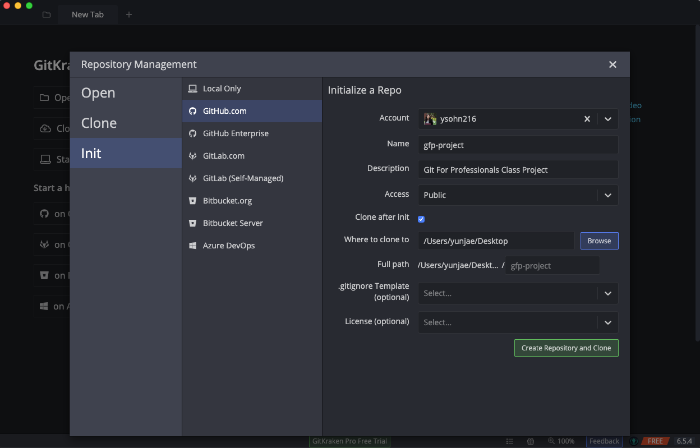

You should now have a tab in Git Kraken that looks similar to the following screenshot (with a different project name). This is your new repo with the automatic initial commit. GitKraken also added an empty README file for you. This view shows all the entries in the history of the repo. There isn't much here yet.

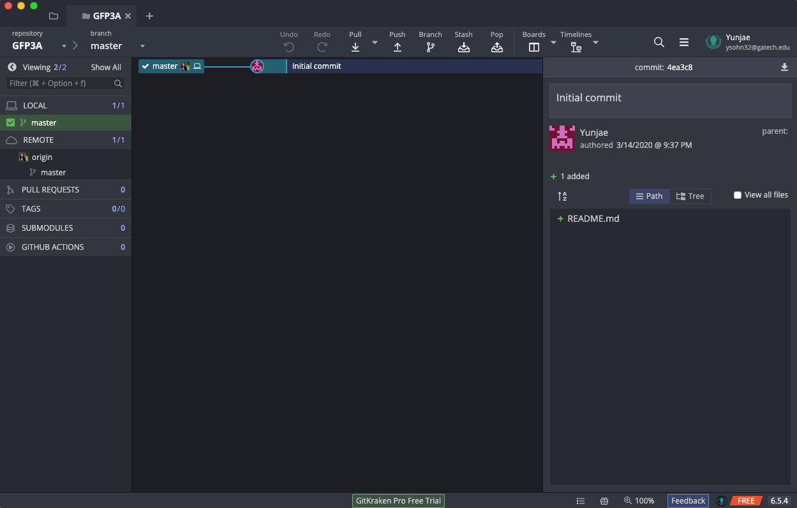

Now you need to share the repo with your partner so they can also have access to it. Get the Github url by clicking on "origin" as shown in the picture below, and then selecting "View origin on Github.com".

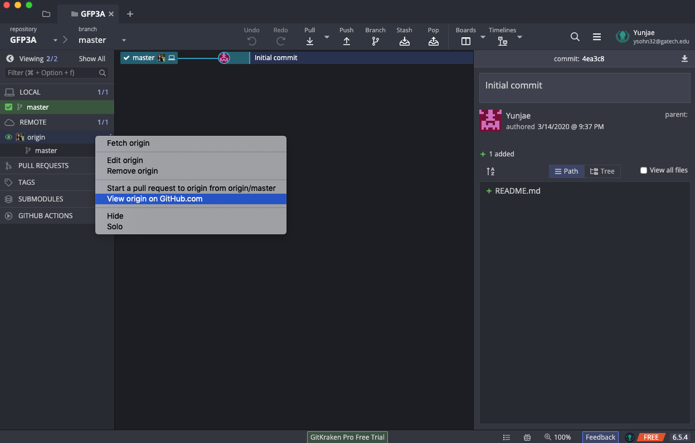

You'll now need to copy and share the URL to this page with your partner.

> :warning: **Checkpoint 1** :warning:

## Branching

As you may have noticed in the previous chapter, it's possible for the repo to have multiple valid states at any point in the history, since people can independently work on it before syncing back up together. Git allows this with a feature called branching, where users can create "branches" off the main history (like branches of a tree) to do work without impacting the main history. This is extremely useful when working on multiple different things in the same repo.

The default branch in Git is called "master," and is generally the main history branch. You can create as many branches as you want, and have different work on each of them. Branches are initially specific to your local copy of the repository, but you can also push them to github for others to see. Let's create some branches so we can see what it looks like.

Click the "Branch" icon in the top bar to create a new local branch. Then give it a title like the following.

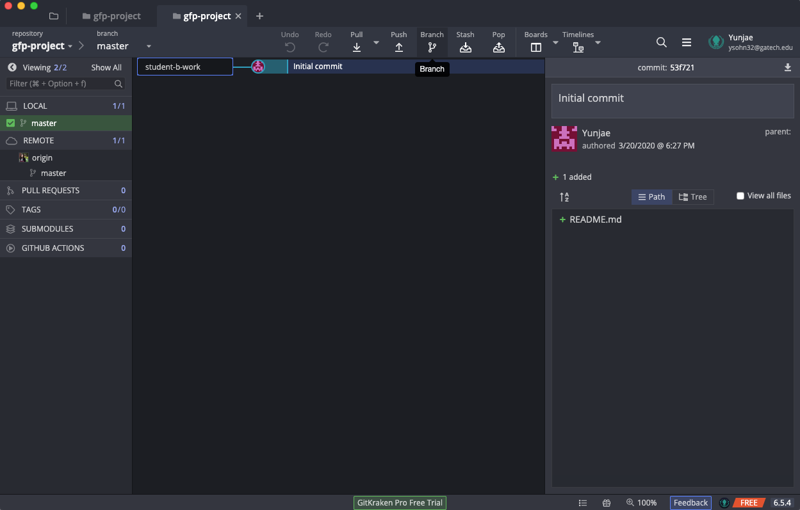

The checkmark by the branch title means that any commits you make will go into that branch's history. Now we'll make a few commits to see how it works. Let's start by modifying the README with what we're going to do.

Open the README as before and add some info about what we'll be doing. This doesn't have to exactly match what's shown below, but make it something similar. Then save, stage, and commit the change.

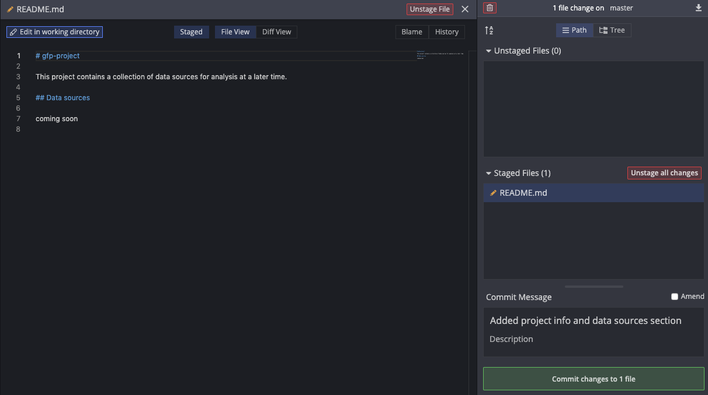

Now if you close out of the README editor, your history should look like the following. You can see that the work branch has moved with the commit you just made, but "master" is still back at the initial commit.

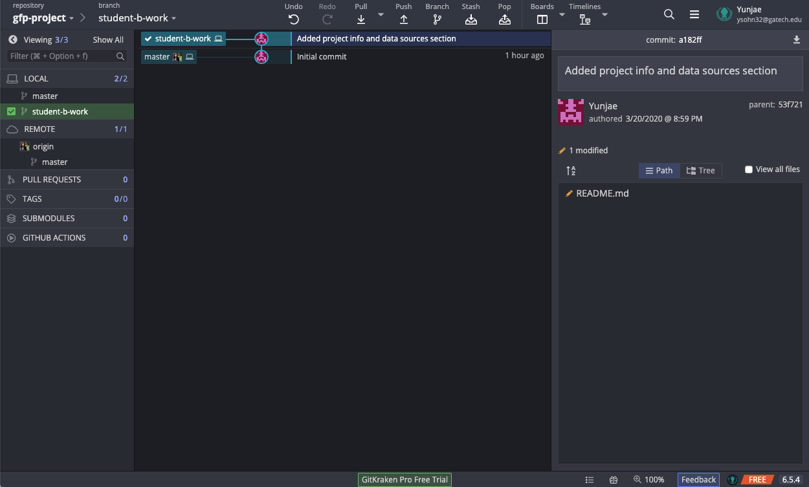

Let's add some data now. Download [this forest fire data file](../data/forestfires.csv) and place it in the project folder. When you go back to Git Kraken, you should see a new //WIP entry above your previous commit. Clicking that WIP entry should bring up the following UI where you can stage the file.

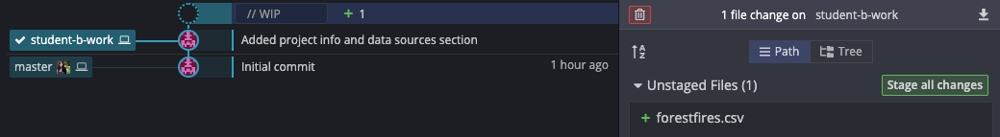

After staging the file, we don't want to commit it yet because we want to link to it in our README file. Open the README and change "coming soon" to the line shown below. Be sure to get the square brackets and parentheses correct so the link works properly.

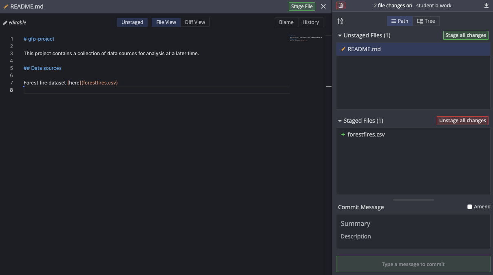

Now save and stage the README change. Add a commit message and commit our change. This change touches two files, but it's all saved as one entry in the repo history. Your commit log should now look as follows.

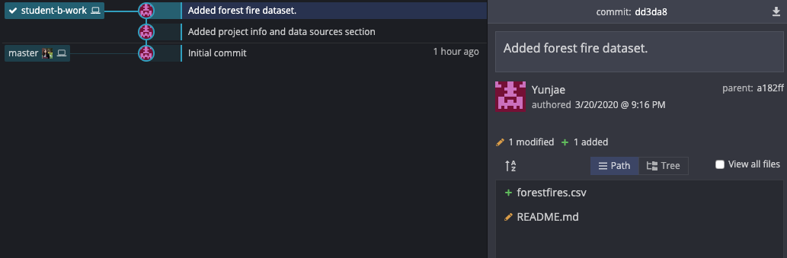

### Rollback and commit again

Now we're going to revert the repository to the previous state before we added the data. Let's say we added the wrong dataset and we want to go back before it was added. Right click the middle commit in the history and select "checkout this commit."

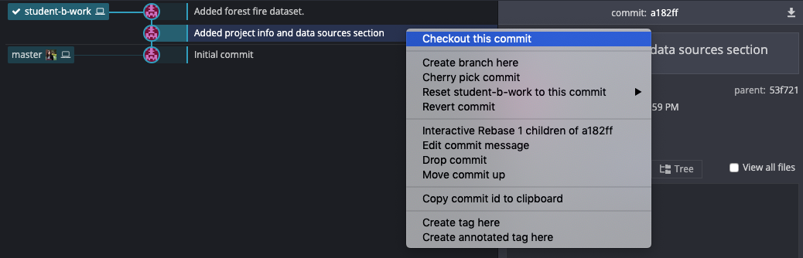

This modifies the state of the project on your computer, so the file that you added previously is now missing. It's not gone forever though. Since this is Git, you can always checkout the commit that added the file and it will be restored. The power of Git is that it tracks all the changes that have happened, but you only ever have one copy of the project on your computer.

We should create a new branch here so we can track any changes we make from here. Right click head and select "create branch." Name the branch student-b-test.

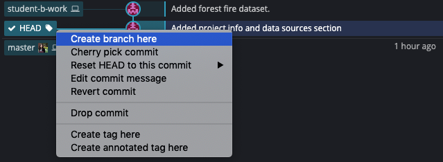

Now let's add in a different dataset. Download [this Old Faithful Geyser eruption times dataset](../data/faithful.csv) from the R dataset collection. Add this file to the project folder as you did before. Update the README like before but link to this old faithful dataset instead of the forest fire dataset. Stage both files and commit them. Your repo should look like the following image after committing those changes.

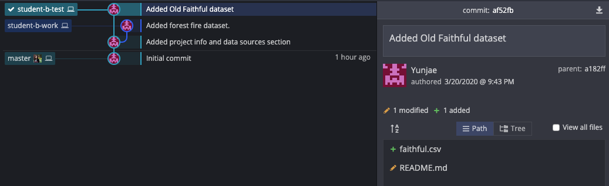

Branches can have multiple commits on them, but the branch name will only appear for the most recent commit. It's not uncommon to work on one branch for a while before merging back to master.

## Merging

Generally when you have a branch, you'll eventually want to merge it back in with the rest of the repo history. Git is able to intuitively merge changes together if they do not conflict. If there is a merge conflict however, it will ask you to resolve it before finishing the merge. Let's try doing a merge that's going to have a conflict.

We've decided that we actually want to keep both datasets in our repo, but they're currently in different branches, so we need to merge them together. To kickoff the merge, click and drag the "student-b-test" branch icon onto the "student-b-work" branch icon. In the resulting menu, select the "merge ..." option as shown below.

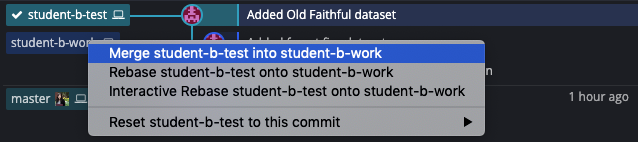

You will get a notification stating that there are merge conflicts and asking if you want to proceed. Click yes to go ahead with the merge. Your screen should change to look like the following. Merging will create a new commit to show how the changes come together, so this screen shows staged files and changed files like a normal commit. You will need to resolve and then stage the "conflicted files."

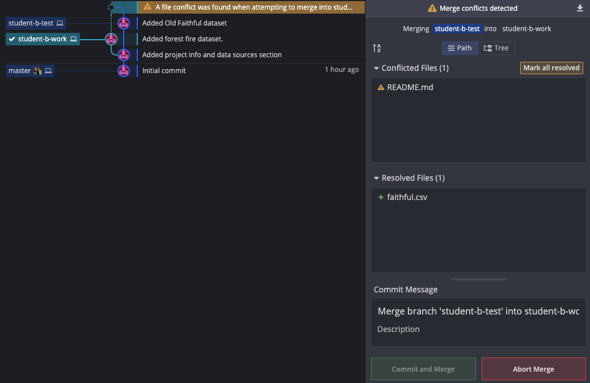

Clicking on that README in the conflicted files section will bring up the diff page, which shows the differences between the two copies of the README file.

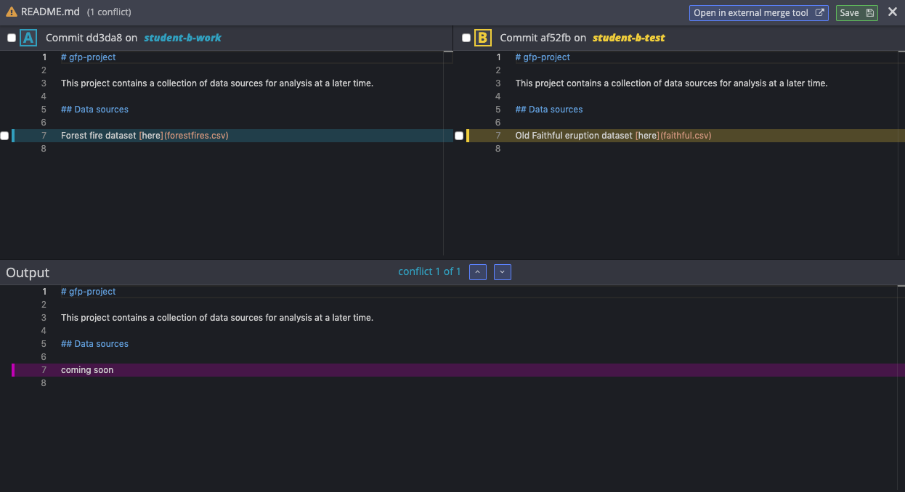

We want to keep both of those lines since we'll have both datasets in the repo. Click the `+` by the changed line in each file. The output file at the bottom should update as you click the plusses. Click save in the top right, which will stage the file with both lines in it. We could commit right now, but the README file is a .md or "markdown" file, so it currently wouldn't show up right when rendered by the web browser. We need to edit README.md again and this time add an empty line between the datasets. Once your screen looks like the image below, we're ready to proceed.

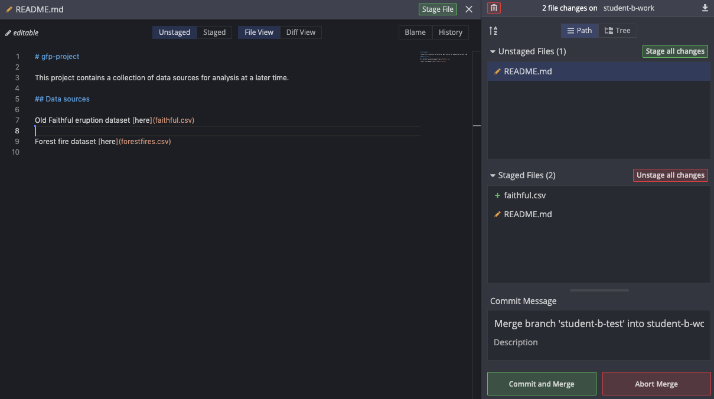

Stage your changes and click "Commit and Merge." There's no need to set or change the commit message this time since this is a merge commit and Git automatically put in the information that you merged two branches together. You can of course always add more information if you'd like.

Congratulations, you just resolved a conflict and merged two separate branches together! You can check the project folder on your computer now and you should see both datasets that we added earlier.

### Deleting old branches

Let's get rid of the student-b-test branch now that we don't need it anymore. Right click "student-b-test" and select "Delete student-b-test" in the dropdown menu. Select "Delete" in the notification that comes up.

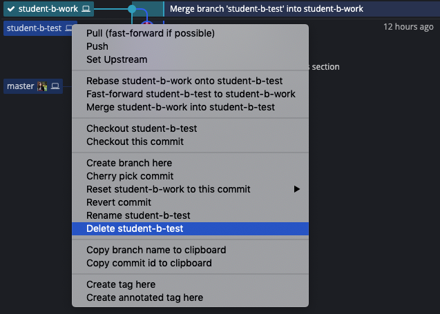

## Pushing to the remote server

Now that you have some interesting work on your local branch, let's push it up to the remote github repository so that your partner can check it out. Notice in the menu on the left the "Local" and "Remote" tabs. This represents the state of your local copy of the repository and the remote copy of the repository. The local copy is what's on your computer, while the remote copy is what's backed up at Github.

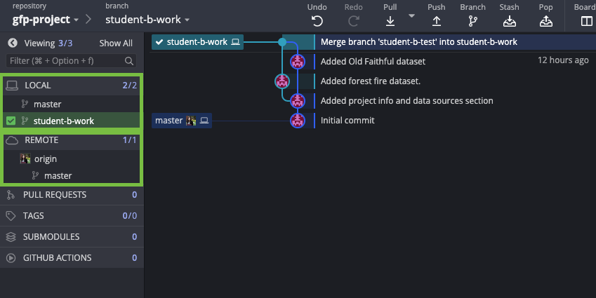

To push your student-b-work branch to Github, click Push in the top bar. Since we don't want to change master, we can create a new branch on Github too that mirrors what's in the student-b-work branch locally. The notification that shows up when you click push will automatically suggest the same name for the remote branch. This is normal, so we will click Submit to continue with the push.

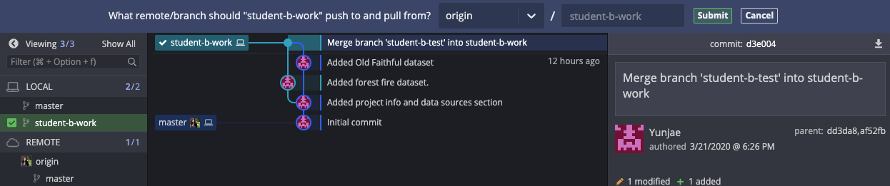

Now after pushing, you should see your student-b-work branch in the left bar under origin and you should see your Github icon next to the branch in the commit log. Here's the final commit log for this chapter:

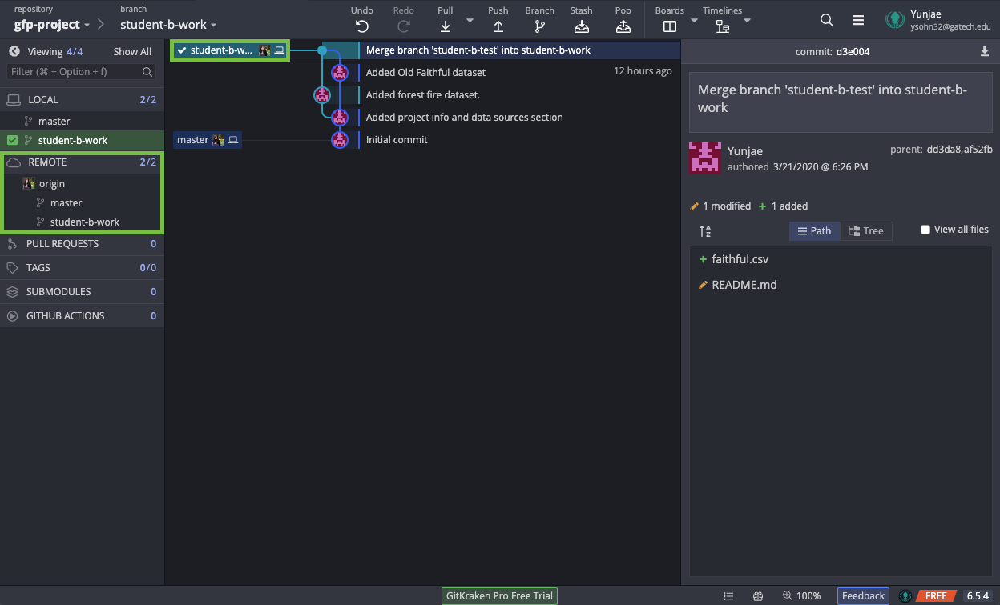

## Summary

In this chapter, you created multiple local branches, merged your changes from two branches together, resolved a merge conflict, deleted an old branch, and pushed your work to Github.

In the next chapter, you'll be reviewing the changes your partner made during this chapter, and they'll be reviewing yours. You will merge your work together and again unify the history into the master branch.

## [Chapter 5: Collaboration with Git](../Chapter5)

