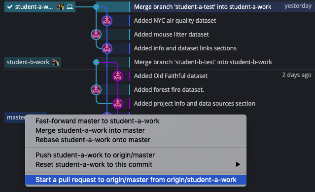

# Chapter 5: Collaboration with Git

In this chapter, we'll dive a bit deeper into some of the collaborative features Git has.

## Pull Requests

Github allows you to publish multiple commits for others to review in a "pull request," or PR. Github users can create a PR for any branch they have created locally or remotely, requesting that it be pulled into another branch in the repo, usually master. PRs give other developers the opportunity to explore your changes and comment on them before they're merged into the main history.

Let's create a PR for the work that each student completed in Chapter 4. In Git Kraken, drag your branch onto the master branch and select the "start a pull request" option, as shown below.

On the following screen, leave all fields as default, but add a PR title; just a summary of the work you did is sufficient. Then scroll to the bottom and click "Create Pull Request".

Once both PRs have been created, go to the repo in Github and click the "Pull Requests" tab. (You've gotten the Github link before at the beginning of Chapter 3 or Chapter 4). Each student should now open their partner's pull request. You should see the main discussion page of the PR when you first open it.

This is where the discussion happens before any changes are merged. There are often suggestions that other users may have to improve the quality of the change before it gets set into the main history. Now click the tab on the right that says "Files Changed." This will show a page like the following screenshot that shows all the changes your partner has made and would like to be merged into the repo.

On this page, you can look through all the changes and comment on individual lines of the files. Let's try it out. As you mouse over the area between the line numbers and the changed text, you should see a blue `+` square pop up at each line as you move your mouse. Click the plus on one of the lines with a dataset link to see the commenting UI.

Now you can add a comment. Type out your thoughts on how useful or interesting the dataset looks to be. Click "Add Single Comment" to leave the comment for your partner to review.

After leaving the comment, we need to check our own PR to see what comments our partner has left for us. Go back to the PR tab and click on your own PR this time. In the discussion, you should see that your partner left you a comment. If you're satisfied with the PR, we can go ahead and merge. At this point, only student B will be able to merge since they created the repo. Student B should merge one of the PRs by clicking "Merge pull request" on the conversation page, then clicking "Confirm merge."

Once this commit is merged, both students can navigate to the other PR. You should see a warning saying that there are merge conflicts!

Luckily, Github has a built in web editor that will let you resolve the merge conflict in the web browser. Whichever student's PR this is should click the "Resolve Conflicts" button and see the following screen. If you are the other student, follow along with the screenshots here. This is the same process you both followed when resolving your local merge conflicts, just using a different editor.

The <<<<<<, ======, and >>>>>> separate sections of changes from each source. In this case, we want to keep all the links, so just delete a few lines so that your file looks similar to the following:

Click "Mark as Resolved" and then "Commit merge" in the top right of the tool. This should take you back to the discussion page of the PR. Note that a new commit has been added for the change you just made resolving the conflict. The "Merge pull request" button should again be green. Student B can go ahead and click this button to complete the PR and merge the change into master.

Finally, everything has been merged into master. All work from both partners is fully represented here along with the full histories for each partner. Anyone with access to this repo can now get the fully up to date datasets, and if they want, go back in history to any previous state of the repo. Click "code" in the top bar to the far left of "Pull Requests" to see the final README file as it will show up for anyone who visits the repo in Github.

Recording work like this is not only useful for the users, who can go back to previous versions, but it's also incredibly useful for others interested in the process you followed in your work. Scientists will find that this is can fully document the process they took to arrive at a final project, if they commit regularly. This history makes work very transparent and much more easily reproducible. If the work is made public, others can even help develop the project by making their own changes and submitting a pull request for the owner to review. Collaboration using Git helps everyone involved. In the next and final chapter, we'll take a look at a real scientific research team using Git to manage and share their work.

## [Chapter 6: Git for Data Science](../Chapter6)
