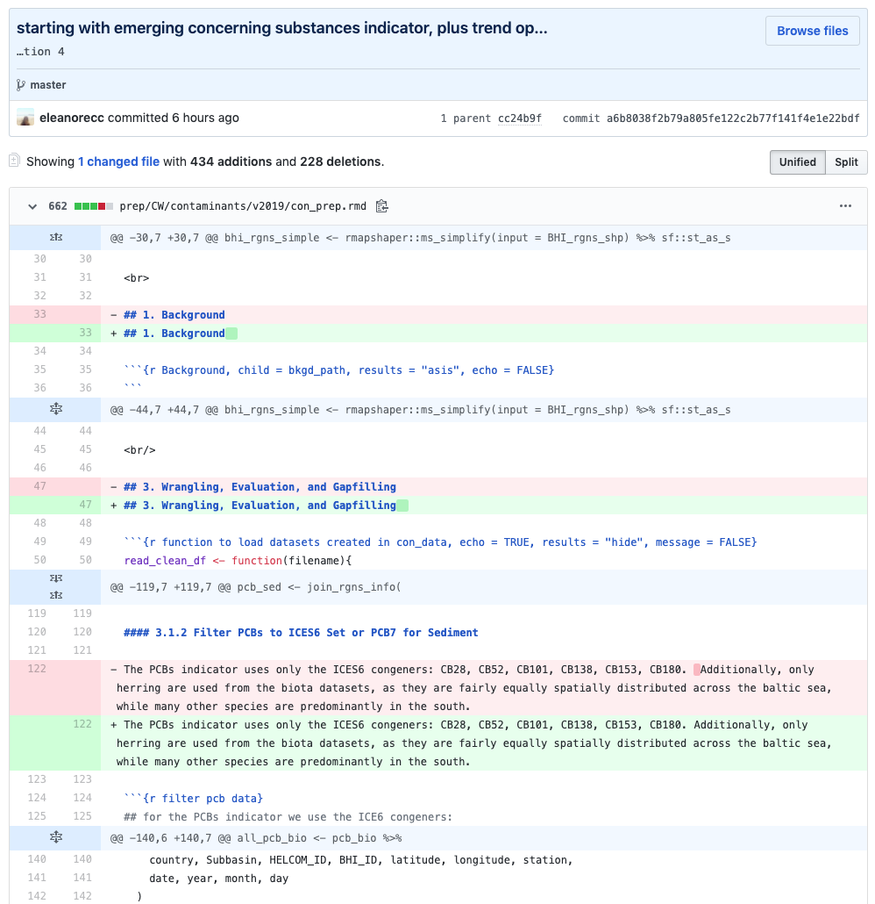

# Chapter 6: Git for Data Science

In this chapter, we'll look into how Git can be used effectively for data science. Lessons can be taken from this chapter and applied to many fields.

## README Files

Generally, projects should have a README.md file in each main folder in the repo, including the top level project folder. These README files will be shown on Github when users navigate through the project, and allow project maintainers to share important information about the project. README files generally contain information like author bios, how to use the repo and its files, further explanation the organization or formats of files within, and often links to other related information.

## Ocean Health Index

Now let's take a look at a real organization managing their data science work through Git. The [Ocean Health Index](https://github.com/ohi-science) is a group of researchers that monitor the health of the ocean through various measurements and analytics over time. Since tracking the health over time is the goal of the project, it's imperative that all their procedures be deterministic and reproducible. They keep their data and analysis code on Github to facilitate these goals.

For this lesson we'll look at their Baltic Health Index (BHI) repo here: [https://github.com/OHI-Science/bhi-prep](https://github.com/OHI-Science/bhi-prep). At the time of this course's creation, the repo README looked as shown in the following screenshot.

We can see that this repo is used mainly to store scripts and documentation used for cleaning and preparing the data that will be used in future analyses. They clearly lay out the organizational structure of their repo, separating steps of the data cleaning process and pulling out some reused functions to a folder that all other folders can then access.

The OHI scientists are using R for their processing, a very popular scripting language among data scientists. Rather than cleaning data by hand to prepare it for analysis, which may be prone to mistakes even with thorough documentation, they opt to use R to automate the cleaning, which will result in identical results every time, no matter who uses them. Although we did not cover any programming in this course, languages like R and Python can be extremely useful in automating processes.

The final thing to note here are the links to other project resources for further context or research. Any other research scientists who come across this project will be able to easily identify who is working on it and what their goals are, perhaps allowing them to contribute as well.

Let's now look at one of their preparation scripts. Click "prep" and then "cw" to arrive at the "Clean waters data preparation" folder. As of this writing, it looked as shown below. Again, this is a README file with the information shown here.

The README has information about the types of components they'll be preparing the data for, noting for each one how the data will be prepared to allow analysis. If we want to see what changes have been made recently here, we can click "History" in the top-right corner. This view, shown below, displays the historical record of changes made to files in this folder.

It looks like there's active development going on as I'm looking through here, with changes committed just 6 hours ago. We can see that only one user has been making changes here, but any colleagues can also see the work she is doing at a glance through the titles of her commits. To see the changes in a commit, you can click on the title and it will take to a file difference screen like the one below.

The full history of changes made here are preserved, so any future researchers that need to replicate or update this procedure can very easily see the exact work done here. Any commit in the history can be viewed like this.

The user in question here may or not be using Git this way, but Git can also be used to synchronize work across multiple computers or workspaces. If you work on a project on your computer most of the time, but also occasionally make changes from a different computer, you can use Git to stay in sync with yourself.

## Retrospection

In this section, on your own or with your partner, try to brainstorm three distinct benefits you could realize by adopting the use of git in your day-to-day work. Use the text box below to help think through your thoughts. Who would benefit from the use of git? What are the potential drawbacks?

<textarea placeholder="Ideas: ..."></textarea>

## [End of Course Assessment](../Final)

To complete the course, continue on to the end-of-course assessment. This will test your grasp of use of Git and provide an opportunity to supply feedback about the course.

